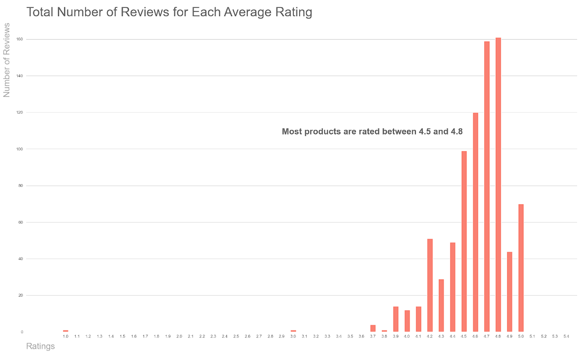
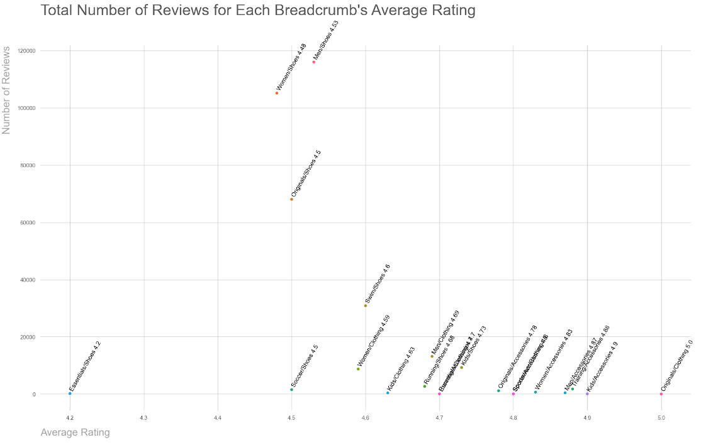
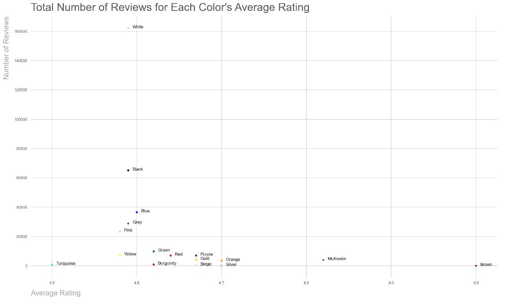
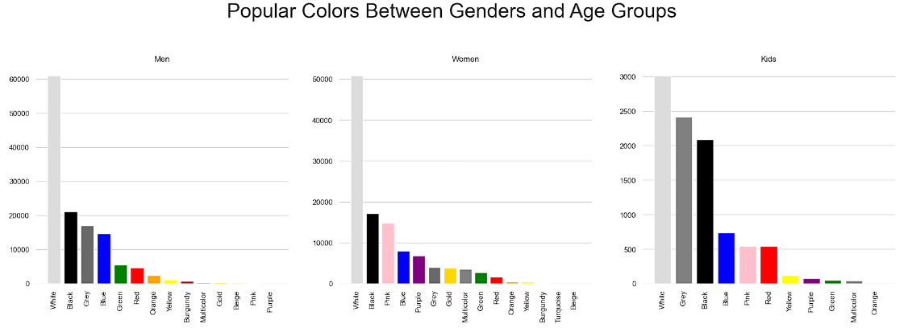
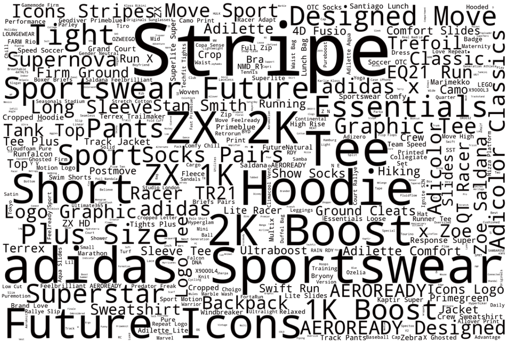
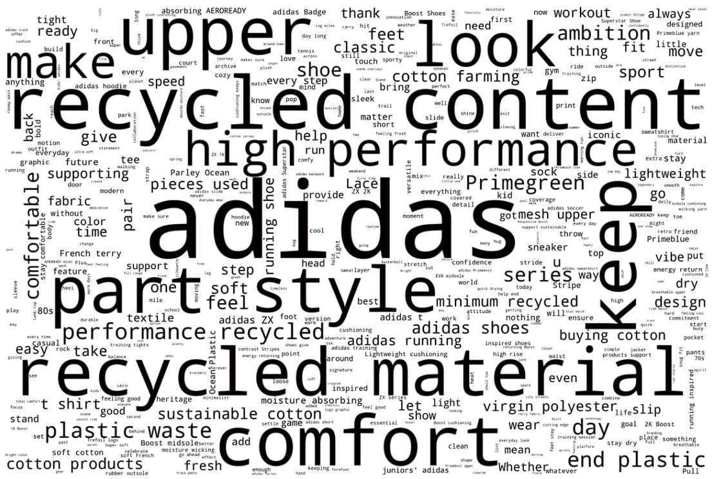

# Adidas Retail EDA

An exploratory data analysis intended to develop a deeper understanding of the Adidas retail dataset and extract possible insights in Python by creating visualizations.


## Documentation

Python Version: 3.9.9

Data Source: ["Adidas Fashion Retail Products Dataset" by The Devastator](https://www.kaggle.com/datasets/thedevastator/adidas-fashion-retail-products-dataset-9300-prod)

Packages: pandas, numpy, matplotlib, seaborn, os, PIL, wordcloud

Article Guide: ["How to make Word Clouds in Python that Don’t Suck" by Anupama Garla](https://towardsdatascience.com/how-to-make-word-clouds-in-python-that-dont-suck-86518cdcb61f)
## Wordcloud Installation

Make sure "Pillow" is installed before importing libraries for wordcloud.

Explanation can be found [here](https://github.com/amueller/word_cloud/issues/729)

```bash
  pip install --upgrade Pillow
```
    
```bash
  from os import path
  from PIL import Image
  from wordcloud import WordCloud, STOPWORDS, ImageColorGenerattor
```
## Data Cleaning

Changes made to dataframe before analyzing:
- Unneccessary columns removed
- Rows containing missing values removed
- Duplicate values "Multicolor" and "Multi" fixed in the "color" column


## EDA

- Total Number of Reviews for Each Average Rating (Histogram)
- Average Rating for the Sum Number of Reviews for Each Category (Scatterplot)
- Total Number of Reviews for Each Color's Average Rating (Scatterplot)
- Total Number of Colors by Category
- Most Popular Colors Between Genders and Age Groups (Bar Subplots)
- Word Clouds for Product Names and Descriptions


## Visualizations





### Word Cloud for Product Names

### Word CLoud for Product Descriptions


